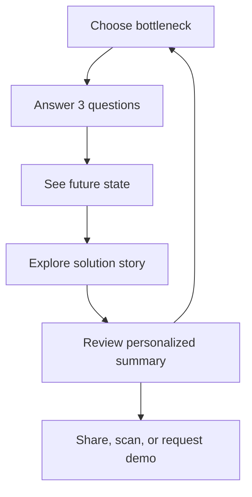
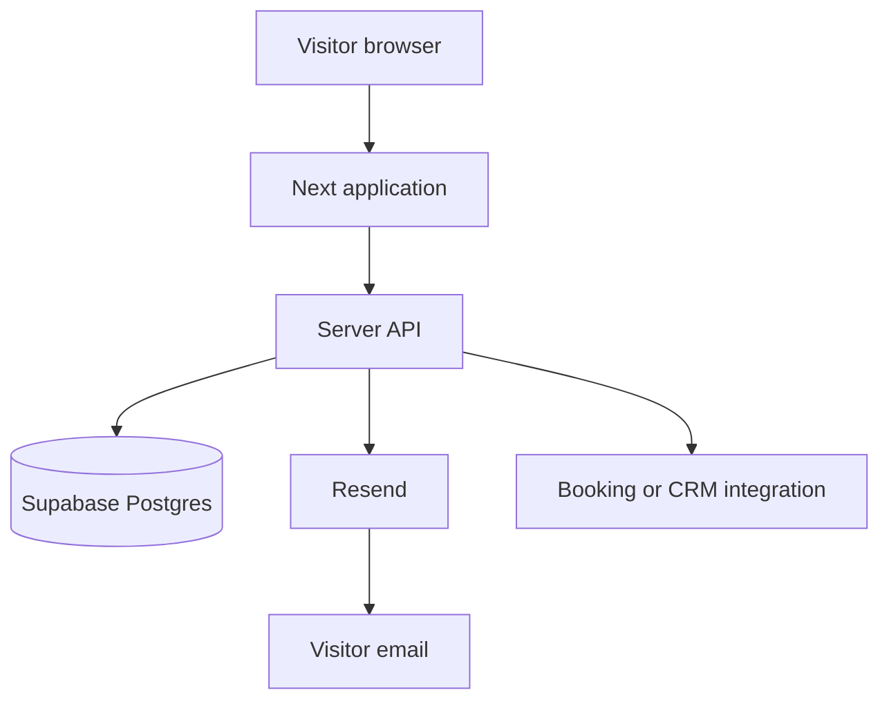

# Advancio Bottleneck Experience — Project Handoff

This document is the authoritative technical and product handoff for an engineer or coding agent continuing the project. It explains what exists today, what the application must do, how it is hosted, where the risks are, and how to continue without breaking the booth experience.

## 1. Executive summary

The site is a self-guided, touch-friendly ITC booth experience for insurance leaders. It starts with “Choose your bottleneck,” asks three multiple-choice questions, supports a spoken or typed Other response, tells a short interactive product story, and builds a personalized takeaway.

The experience is intentionally not a traditional marketing site. Its primary job is to create a useful conversation at a conference booth and provide a memorable follow-up link.

Current production status:

| Area | Status |
| --- | --- |
| Four bottleneck paths | Implemented |
| Three questions per path | Implemented |
| Multiple choice plus Other | Implemented |
| Browser speech-to-text | Implemented |
| Back and restart controls | Implemented |
| Full journey summary | Implemented |
| Anonymous persistence | Implemented with Cloudflare D1 |
| Personalized QR/share link | Implemented |
| Idle reset for booth use | Implemented |
| Product screenshot slots | Implemented; approved image files still need to be supplied |
| Supabase | Planned for an external/full deployment; not connected |
| Resend email delivery | Planned; not connected |
| Contact capture/consent | Not implemented |
| Admin interface | Intentionally out of scope |
| Automated end-to-end tests | Not implemented |

## 2. Product goal and audience

### Goal

Help an insurance executive quickly identify where work is getting stuck, visualize a better future state, and understand which Advancio Spark accelerator is most relevant.

### Primary users

- Carrier executives and functional leaders visiting the booth
- Chief underwriting officers and underwriting leaders
- Chief claims officers and claims leaders
- CTOs and technology leaders
- Marketing, distribution, and customer-experience leaders
- Advancio booth staff who use the result to start a five-minute conversation

### Business outcomes

- Create higher-quality booth conversations.
- Demonstrate Advancio’s insurance domain knowledge and accelerators.
- Capture a visitor’s expressed bottlenecks in a structured form.
- Give the visitor a personalized artifact they can revisit or share.
- Create a bridge from a booth interaction to a deeper demo.

## 3. User journey



### Paths and recommendations

| Path key | Visible area | Recommendation | Core message |
| --- | --- | --- | --- |
| `distribution` | Distribution | Spark Rater | One core sales engine for Spark Direct and Spark Agents |
| `underwriting` | Underwriting | Spark Underwriting | Assemble risk context so underwriters focus on judgment |
| `claims` | Claims | Spark Claim | AI-powered FNOL/FROI intake and triage |
| `experience` | Customer Experience | Spark Navigator + Portal | Branded self-service with AI-guided navigation |

### State progression

The client uses these view names:

- `home`
- `quiz`
- `future`
- `solution`
- `summary`

There are three questions and three product-story slides for each path. The client tracks the current question, draft answer, committed answers, current slide, viewed slides, save state, and anonymous session ID.

## 4. Functional requirements

### FR-01 — Home and path selection

- Display four evenly sized path cards.
- Use “Choose your bottleneck” as the primary instruction.
- A visitor must be able to begin with one touch or click.
- Selecting a path starts a fresh three-question journey for that area.

### FR-02 — Questions and answers

- Each path has exactly three questions in the current content model.
- Each question provides three predefined choices plus Other.
- Only one answer is committed per question.
- Continue remains disabled until an answer exists.
- All committed answers must be persisted.
- Going back must restore the previously committed answer for editing.

### FR-03 — Other answer

- Other reveals a text area.
- The visitor can type or use speech-to-text.
- Speech input uses the browser recognition API when available.
- The visitor must be able to review/edit the transcript before continuing.
- Only the final text and input method are saved. Audio is never stored.
- If speech recognition is unavailable, typing remains fully functional.

### FR-04 — Future state

- After the third answer, show a future-state statement tailored to the selected path.
- Echo the visitor’s three answers so the transition feels personalized.
- Provide a clear action to reveal the recommended accelerator.

### FR-05 — Solution story

- Show the path’s recommended Spark product.
- Provide three story frames.
- Track which frames were viewed.
- Support direct slide selection and sequential navigation.
- Reserve a screenshot area for an approved product image.
- If a screenshot is missing, display the designed placeholder without a broken-image artifact.

### FR-06 — Summary

- Summarize the full experience, including:
  - chosen area;
  - recommended accelerator;
  - all question text and answers;
  - whether an answer was predefined or Other;
  - future state;
  - viewed story frames; and
  - recommendation explanation.
- Offer an immediate five-minute booth demo CTA.
- Offer restart to explore another bottleneck.
- Offer a personalized QR code and share/copy controls.
- Link to Advancio’s deeper-demo booking page.

### FR-07 — Persistence and restoration

- Assign a high-entropy anonymous session ID in browser `sessionStorage`.
- Save progress after meaningful transitions.
- Allow a `?session=<id>` URL to restore a completed journey into the summary.
- Return understandable errors for invalid or missing sessions.
- Do not block the experience when a save fails.
- Retain a browser-side pending copy after failure; a future version should implement an explicit retry/recovery strategy.

### FR-08 — Booth reset

- Do not idle-reset while the visitor is on Home.
- After 165 seconds of inactivity elsewhere, show a 15-second warning.
- Allow the visitor to continue the session.
- If no action occurs, reset the experience for the next visitor.
- Restart must clear the old anonymous browser session and create a new one.

### FR-09 — Responsive and accessible interaction

- Support large touch displays, laptops, tablets, and mobile handoff links.
- Maintain usable keyboard focus and semantic labels.
- Keep touch targets large and readable.
- Avoid horizontal scrolling and clipped content.
- Respect reduced-motion preferences where styling provides animation.
- Do not depend on color alone to communicate selection or state.

### FR-10 — Optional future contact delivery

This requirement is approved as a direction but not implemented:

- Contact details must be optional and requested only after the value of the summary is visible.
- Explain why email or phone is requested.
- Require affirmative consent before sending follow-up material.
- Use Resend from server-side code only.
- Never include API keys in client bundles.
- Store consent timestamp, consent language/version, and delivery status.
- Avoid collecting information that is not necessary for the requested follow-up.

## 5. Non-functional requirements

### Performance

- The first screen should render quickly on conference Wi-Fi.
- Core journey behavior must not depend on large media downloads.
- Optimize supplied screenshots before publishing.
- Avoid adding dependencies for behavior the browser already provides reliably.

### Reliability

- The journey must remain usable if persistence, QR generation, speech recognition, native sharing, or clipboard access fails.
- Server errors should not expose stack traces or infrastructure details.
- Database changes require migrations and backward-compatible rollout planning.

### Privacy

- Current sessions are anonymous but may contain free-text answers.
- Do not ask for sensitive insurance, claimant, employee, or policy information.
- The application must never persist raw voice audio or send it to its own backend. Browser speech-recognition behavior should be disclosed when consent or privacy requirements call for it.
- Define retention and deletion before collecting contact details.
- Treat personalized session URLs as bearer links.

### Security

- Validate session IDs and request bodies server-side.
- Apply payload limits.
- Escape visitor-controlled content before HTML insertion.
- Add rate limiting/abuse protection before broad public promotion or contact delivery.
- Keep database administrative credentials and email credentials server-side.
- Restrict CORS to expected origins if an external API is introduced.

### Maintainability

- Keep the product copy/content model separate from rendering logic during future refactoring.
- Keep API contracts documented.
- Add focused end-to-end tests before a large client-engine rewrite.
- Update this handoff whenever infrastructure or the data model changes.

## 6. Current architecture

```mermaid
flowchart TD
    A[Visitor browser] --> B[Next/Vinext UI]
    B --> C[experience.js state engine]
    C --> D[/api/session]
    D --> E[(Cloudflare D1)]
    C --> F[Web Speech API]
    C --> G[Web Share or Clipboard]
    C --> H[QRCode.js CDN]
```

### Presentation shell

`app/page.tsx` renders the elements that remain across the journey:

- decorative background;
- Advancio header;
- Back and Restart controls;
- `<main id="app">` rendering target;
- footer;
- idle-warning overlay;
- toast region; and
- QRCode.js plus `/experience.js` script tags.

### Client experience engine

`public/experience.js` is a plain browser script. It owns:

- the full content configuration for all four paths;
- state;
- all render functions;
- event delegation;
- navigation and history behavior;
- voice recognition;
- summary generation;
- QR/share/copy behavior;
- API persistence;
- URL restoration; and
- inactivity reset.

This approach is simple and works, but the file has multiple responsibilities. Refactor it only after tests cover current behavior. A safe destination would separate path content, state/reducer, UI components, API client, speech adapter, and sharing adapter.

### Styling

`app/globals.css` contains the complete visual language:

- Advancio red, blue, black, and white palette;
- path-specific accent variables;
- booth-scale typography and touch targets;
- responsive layouts;
- transitions and ambient visuals;
- summary, QR, dialog, and toast treatments.

Preserve this visual direction during component refactors.

### Session API

`app/api/session/route.ts` runs on the Cloudflare Worker runtime.

Current endpoints:

| Method | URL | Purpose |
| --- | --- | --- |
| `POST` | `/api/session` | Insert or update an anonymous journey |
| `GET` | `/api/session?id=<sessionId>` | Retrieve a saved journey |

POST request shape:

```json
{
  "sessionId": "high-entropy-id",
  "payload": {
    "reason": "answer",
    "path": "claims",
    "view": "quiz",
    "step": 1,
    "slide": 0,
    "answers": [],
    "viewedSlides": [],
    "summary": null,
    "updatedAt": "ISO-8601 timestamp"
  }
}
```

Successful POST response:

```json
{
  "saved": true,
  "sessionId": "high-entropy-id"
}
```

Successful GET response:

```json
{
  "session": {
    "path": "claims",
    "answers": [],
    "view": "summary"
  }
}
```

The route validates the ID format, limits several serialized fields by character count, and upserts the record. It does not currently use a full runtime schema validator, authentication, rate limiting, expiration, or ownership checks.

## 7. Current data model

Database: Cloudflare D1 (SQLite-compatible).

Table: `booth_sessions`

| Column | Type | Notes |
| --- | --- | --- |
| `id` | text primary key | Anonymous browser-generated session ID |
| `path` | text nullable | One of the four path keys |
| `current_view` | text | Defaults to `home` |
| `answers_json` | text | Serialized committed answers |
| `summary_json` | text nullable | Serialized full summary when complete |
| `payload_json` | text | Complete latest session payload |
| `created_at` | text | Database timestamp |
| `updated_at` | text | Updated on every upsert |

Drizzle defines the table in `db/schema.ts`. The generated SQL is in `drizzle/0000_yielding_komodo.sql`.

The application currently queries D1 directly in the API route instead of calling `getDb()` from `db/index.ts`. The Drizzle layer is present for schema/migration management.

## 8. Infrastructure and deployment

### Current hosted infrastructure

| Layer | Technology |
| --- | --- |
| UI framework | Next.js 16.3.4 + React 19.2.6 |
| Build/runtime adapter | Vinext 1.0 beta + Vite 8 |
| Hosting runtime | Cloudflare Workers through ChatGPT Sites |
| Database | Cloudflare D1 binding named `DB` |
| ORM/migrations | Drizzle ORM + Drizzle Kit |
| Package manager | pnpm 11.25.0 |
| Minimum Node | 22.13.0 |
| Object storage | None |
| Authentication | None required for visitor journey |
| Email provider | None |

`.openai/hosting.json` contains the Sites project ID and declares the D1 binding. Do not place environment values or secrets in this file.

### Build path

- `pnpm dev` starts the local development environment.
- `pnpm build` produces the Cloudflare-compatible server bundle.
- `pnpm start` runs the built Worker locally through Wrangler.
- `pnpm db:generate` generates a migration after a Drizzle schema change.

The scripts under `scripts/` and the checked-in Sites Vite plugin support this environment. Do not delete them as generic boilerplate while Sites remains the deployment target.

### Third-party browser dependencies

- QRCode.js is loaded from cdnjs at runtime.
- Web Speech API availability varies by browser.
- Web Share and Clipboard depend on browser support and secure context.

A future hardening pass should self-host a pinned QR library or bundle it so conference Wi-Fi/CDN failure cannot remove QR generation.

## 9. Intended Supabase and Resend architecture

The owner intends to use Supabase and Resend for the version developed outside the current Sites/D1 deployment. This is a target architecture, not the current one.



### Migration principles

- Keep browser code calling an application API; do not grant the browser unrestricted database access.
- Use Supabase’s server-side client for privileged writes.
- If anonymous browser writes use the public client, create strict row-level security policies and never expose a service-role key.
- Use Resend only from the server.
- Keep the existing `/api/session` request/response shape during the first migration so the UI does not need to change simultaneously.
- Backfill or migrate D1 data only if the owner requires historical booth sessions.
- Choose one system of record at cutover and document the date.

### Suggested target tables

#### `sessions`

- `id text primary key` to preserve the current opaque session-ID contract; alternatively, generate UUIDs on the server and update the client contract deliberately
- `path text`
- `current_view text`
- `step integer`
- `slide integer`
- `answers jsonb not null default '[]'`
- `viewed_slides jsonb not null default '[]'`
- `summary jsonb`
- `source text default 'itc-booth'`
- `created_at timestamptz default now()`
- `updated_at timestamptz default now()`
- `expires_at timestamptz`

#### `follow_up_requests`

- `id uuid primary key`
- `session_id text references sessions(id)`
- `email text`
- `phone text nullable`
- `name text nullable`
- `company text nullable`
- `consent_text_version text`
- `consented_at timestamptz`
- `delivery_status text`
- `resend_message_id text nullable`
- `created_at timestamptz default now()`

Do not add a lead table or contact fields until the form, consent text, retention, and recipient behavior are approved.

### Suggested server routes

- `POST /api/session` — create/upsert anonymous journey
- `GET /api/session?id=...` — restore journey
- `POST /api/follow-up` — validate consent, save request, and send the summary through Resend
- Optional `POST /api/events` — append structured analytics events if the owner approves event-level tracking

### Environment values for the target architecture

Exact names can be adjusted, but keep public and secret values distinct:

- `NEXT_PUBLIC_SUPABASE_URL`
- `NEXT_PUBLIC_SUPABASE_ANON_KEY` only if a public client is truly needed
- `SUPABASE_SERVICE_ROLE_KEY` server only
- `RESEND_API_KEY` server only
- `FOLLOW_UP_FROM_EMAIL`
- `FOLLOW_UP_REPLY_TO_EMAIL`
- `APP_BASE_URL`

Never commit real values. Add a tracked `.env.example` only when these integrations are implemented.

## 10. File-by-file map

| Path | Responsibility | Change when |
| --- | --- | --- |
| `app/page.tsx` | Persistent HTML shell and script loading | Changing global chrome or page-level controls |
| `app/layout.tsx` | Metadata and root document | Changing title, description, icons, or global providers |
| `app/globals.css` | Entire responsive visual system | Any visual/UI change |
| `public/experience.js` | Content, state machine, rendering, persistence, voice, share, idle reset | Most product behavior/content changes |
| `app/api/session/route.ts` | Session API | Persistence contract or validation changes |
| `db/schema.ts` | D1 schema source | Database model changes |
| `db/index.ts` | Drizzle/D1 helper | Server data-access refactor |
| `drizzle/` | Generated migrations and metadata | After schema generation |
| `public/product-screenshots/` | Approved screenshots | Adding final product visuals |
| `PRODUCT_SCREENSHOTS.md` | Screenshot naming guide | Changing slots/naming |
| `vite.config.ts` | Vinext, Cloudflare, bindings, local runtime | Infrastructure changes only |
| `.openai/hosting.json` | Sites identity and logical bindings | Sites capability/binding changes only |
| `scripts/` | Supported install/build/runtime wrappers | Toolchain changes only |
| `app/chatgpt-auth.ts` | Optional ChatGPT auth helpers from the starter | Only if sign-in becomes an explicit requirement |

`app/chatgpt-auth.ts` is not used by the public booth journey today. Do not introduce sign-in merely because the helper exists.

## 11. Current client state

The state object contains:

| Field | Meaning |
| --- | --- |
| `view` | Current experience screen |
| `path` | Selected bottleneck key |
| `step` | Current question index |
| `answers` | Committed answers |
| `draftAnswer` | Current uncommitted selection/transcript |
| `slide` | Current solution frame index |
| `viewedSlides` | Indices included in the final summary |
| `shared` | Whether a restored/shared journey is being shown |
| `saveStatus` | `idle`, `saving`, `saved`, or `error` |
| `sessionId` | Anonymous high-entropy identifier |

The renderer replaces the contents of `#app` for each view and uses document-level event delegation with `data-*` attributes.

## 12. Known gaps and risks

Prioritize these based on the intended launch environment:

1. Product screenshots have placeholders but the approved image files are not in the repository.
2. The QR library depends on a public CDN.
3. `public/experience.js` is large and imperative, making regression risk higher.
4. There are no automated end-to-end tests.
5. API body validation is basic rather than schema-based.
6. The session GET endpoint is intentionally anonymous; anyone with a valid bearer link can view that session.
7. Sessions have no application-level expiration or retention cleanup.
8. There is no rate limiting or abuse protection.
9. Free-text Other answers could contain unintended personal or sensitive information.
10. Pending-save data is stored in `sessionStorage`, but there is no explicit reload recovery UI.
11. There is no contact capture, consent record, or Resend integration.
12. There is no analytics/event model beyond the latest saved session state.
13. The current project contains an unused authentication helper that could confuse future maintainers.

## 13. Recommended roadmap

### Phase 1 — Booth readiness

- Add and optimize all 12 approved product screenshots.
- Confirm the final five-minute and deeper-demo booking behavior.
- Test the complete journey on the exact booth browser and display.
- Bundle or self-host QR generation.
- Add a short privacy notice for free-text answers.
- Verify idle timing with real booth staff.

### Phase 2 — Reliability and measurement

- Add runtime schema validation.
- Add rate limiting and basic abuse controls.
- Add session expiration/cleanup.
- Add end-to-end tests for every path, Other, Back, Restart, and share restoration.
- Define a lightweight analytics event model only after reporting needs are approved.

### Phase 3 — Supabase and Resend

- Confirm hosting target and data ownership.
- Create Supabase schema, indexes, and policies.
- Migrate the session API without changing the browser contract.
- Add optional contact form and consent language.
- Add Resend template for the personalized takeaway.
- Log delivery status without storing unnecessary message content.
- Define retention and deletion procedures.

### Phase 4 — Maintainability

- Move path content into typed configuration.
- Move the state machine to a reducer or explicit finite-state model.
- Convert rendering to typed React components.
- Isolate adapters for persistence, speech, QR, share, and booking.
- Keep a compatibility test for existing shared links during the refactor.

## 14. Acceptance checklist

Before release, verify:

- [ ] All four cards are evenly spaced and selectable.
- [ ] Every path displays its correct questions and recommendation.
- [ ] Every predefined answer persists.
- [ ] Typed Other persists.
- [ ] Voice transcript persists without audio storage.
- [ ] Back restores the correct prior state.
- [ ] Restart clears the current browser session and returns Home.
- [ ] All three solution frames work for each path.
- [ ] Product screenshots load or fall back cleanly.
- [ ] Summary includes all answers and viewed stages.
- [ ] QR code points to the correct personalized URL.
- [ ] Shared URL restores the correct summary.
- [ ] Five-minute booth CTA and deeper-demo CTA use final approved destinations.
- [ ] Idle warning and automatic reset work.
- [ ] Database failures do not block the experience.
- [ ] Desktop booth, tablet, and mobile layouts are usable.
- [ ] Keyboard navigation and focus states are usable.
- [ ] No secrets appear in client code, logs, source control, or URLs.
- [ ] Production build succeeds.

## 15. Copy-and-paste kickoff prompt for Claude Code

Use this after opening the repository in Claude Code:

```text
You are continuing the Advancio Bottleneck Experience, a production interactive insurance conference-booth application.

First read CLAUDE.md, README.md, and docs/PROJECT_HANDOFF.md in full. Then inspect only the source files relevant to the task I give you.

Important context:
- The current deployed application uses Next.js/React through Vinext on Cloudflare Workers and persists anonymous sessions in Cloudflare D1.
- Supabase and Resend are the intended future stack for an external/full deployment, but they are not currently integrated.
- Do not mix D1 and Supabase or add email/contact capture without explicitly stating the target deployment architecture and consent requirements.
- Preserve all current booth behavior: four paths, three questions, multiple choice plus typed/spoken Other, all-answer persistence, Back, Restart, future state, product story, full summary, QR/share restoration, fallbacks, and idle reset.
- Never persist voice audio or send it to the application backend. Never expose secrets to the browser. Do not create an admin interface unless I explicitly ask.

Before coding, summarize:
1. what you believe the requested change is;
2. which files you expect to modify;
3. whether it affects the current Sites/D1 track or the future Supabase/Resend track; and
4. the acceptance tests you will run.

After coding, run the production build and the relevant journey checks. Update docs/PROJECT_HANDOFF.md if architecture, infrastructure, requirements, data, APIs, or operating assumptions changed.

My first task is: [PASTE THE NEXT TASK HERE]
```
